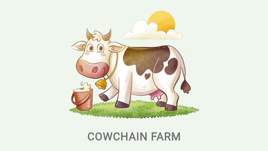

<br>
<div align="center">

<p align="center">Smart contract-based Cow Farming web app built with Flutter and Soroban</p>
</div>

## About Cowchain Farm

Cowchain Farm combines Rust-based smart contracts built with [Soroban](https://soroban.stellar.org) on Stellar
blockchain, and a web app client to
access the smart contracts functionality built with one of the most popular cross-platform
frameworks, [Flutter](https://flutter.dev).

Cowchain Farm smart contract will cover several capabilities of Soroban that exist in
the [Preview 11 release](https://soroban.stellar.org/docs/reference/releases), which include:

1. Authentication and authorization
2. Error handling
3. Custom types
4. Contract initialization
5. Contract upgrading
6. Payment transfer
7. Data storage expiration
8. Events

While the Cowchain Farm web app will cover the following:

1. Calling Soroban smart contract function using [Flutter Stellar SDK](https://pub.dev/packages/stellar_flutter_sdk)
2. Communication with the [Freighter](https://www.freighter.app) browser extension

And the latest addition is the Cowchain Farm notification service, which includes:

1. Ingesting events from Soroban smart contracts using [Dart CLI](https://dart.dev/tutorials/server/get-started) with [Flutter Stellar SDK](https://pub.dev/packages/stellar_flutter_sdk)
2. Sending notifications to Cowchain Farm users using [OneSignal](https://onesignal.com)

## Get Started

This article is specifically about the Dart CLI notification service for Cowchain Farm.

Discussion for Cowchain Farm smart contract is in the [Cowchain Farm Soroban repository](https://github.com/hasToDev/cowchain-farm-soroban), and the discussion for Cowchain Farm web app is in the [Cowchain Farm App repository](https://github.com/hasToDev/cowchain-farm-app).

The Cowchain Farm Dart CLI in this repository was developed using `Dart version 3.1.2`

## Prerequisites

Before running the Cowchain Farm Dart CLI, there are several things we need first, including:

1. OneSignal App ID
2. OneSignal Rest API Key
3. OneSignal Android Notification Channel ID
4. Soroban smart contract Address (contract that we will listen to)
5. Stellar account Secret Key (for invoking smart contract function)

## Clone, Run, and Build

1. Clone the repository:
    ```shell
    git clone https://github.com/hasToDev/cowchain-farm-alert.git
    ```
2. Install all the project dependencies:
    ```dart
    dart pub get
    ```
3. Run on local machine:
    ```dart
    dart run bin/cowchain_farm_alert.dart --soroban \
    --app-id <OneSignal App ID> \
    --restapi-key <OneSignal Rest API Key> \
    --channel-id-android <OneSignal Android Notification Channel ID> \
    --notification-color <color in ARGB format, e.g. FFFFAC45 \
    --soroban-contract-address <Soroban smart contract address> \
    --stellar-seed <Stellar account secret key for invoking smart contract> \
    --interval <check Soroban event every X second, e.g 60>
    ```
4. Build on local machine:
    ```dart
    dart compile exe bin/cowchain_farm_alert.dart
    ```

## Deployment

Dart is known for its limitation, which is [No cross-compilation support](https://github.com/dart-lang/sdk/issues/28617).

It means the compiler can create machine code only for the operating system you’re compiling.
You need to run the compiler three times on three different machines to create executables for macOS, Windows, and Linux.

To overcome this limitation, we use a continuous integration (CI) provider that supports all three operating systems, [Codemagic](https://codemagic.io/start/).
You can also follow [this](https://blog.codemagic.io/cross-compiling-dart-cli-applications-with-codemagic/) articles to learn how to Cross-compiling Dart CLI applications with Codemagic.

For the Cowchain Farm notification service, we choose to deploy the Dart CLI inside a [Docker](https://www.docker.com) container in a [cloud server](https://www.vultr.com/?ref=9253209) that runs [Ubuntu](https://ubuntu.com/).

The following are the files used to carry out the deployment apart from the compiled Dart CLI:

1. Dockerfile
   ```shell
   FROM alpine:latest
   LABEL maintainer="hasToDev"
   RUN apk add libc6-compat
   RUN mkdir /app
   WORKDIR /app
   COPY . .
   ENV PORT 8080
   RUN chmod +x /app/cowchain
   CMD ["/app/cowchain", \
   "--soroban", \
   "--app-id=xxxx-xxxx-xxxx-xxxx", \
   "--restapi-key=xxxx", \
   "--channel-id-android=xxxx-xxxx-xxxx-xxxx", \
   "--notification-color=FFFFAC45", \
   "--soroban-contract-address=CAV...HXJ", \
   "--stellar-seed=SY6...WQZ", \
   "--interval=60" \
   ]
   ```
2. compose.yaml
   ```yaml
   version: '3.7'
   
   services:
     cowapp:
       container_name: cowapp_dev
       restart: always
       build: .
       image: cowapp
       networks:
         - soroban_net
       volumes:
         - soroban_vol:/app/
       ports:
         - 80:8080
   networks:
     soroban_net:
       external: true
   volumes:
     soroban_vol:
       external: true
   ```

## What does this CLI do?

This CLI will listen to events emitted by Cowchain Farm smart contracts.
Then, this event will be processed according to its type.

This CLI will send notifications when your cow starts to feel hungry, when you win an auction, or when your funds are refunded because someone outbid you at an auction.

So that you can receive notifications provided by the CLI, you must install the Cowchain Farm notification app on your mobile phone, which you can download at [this link](https://www.dropbox.com/scl/fi/q6qksqguoi30dgfo3t5c2/cowchain_farm_200.apk?rlkey=7n0xadf3j6r01hp65jxsdo0fo&raw=1).

You can also clone the repository for Cowchain Farm notification app at [Cowchain Farm App repository](https://github.com/hasToDev/cowchain-farm-app), and build the app by yourself.
Currently, the app only supports Android mobile phones.

After installing, register the account ID or public key of the Stellar account you use to play Cowchain Farm.
Once registered, notifications sent by CLI will reach you on your phone.

## License

The Cowchain Farm is distributed under an MIT license. See the [LICENSE](LICENSE) for more information.

[](https://opensource.org/licenses/MIT)

## Contact

[Hasto](https://github.com/hasToDev) - [@HasToDev](https://twitter.com/HasToDev)